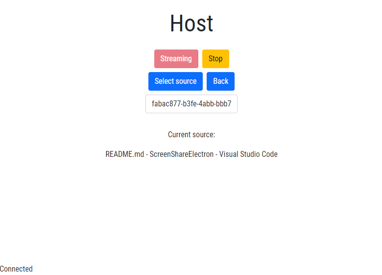
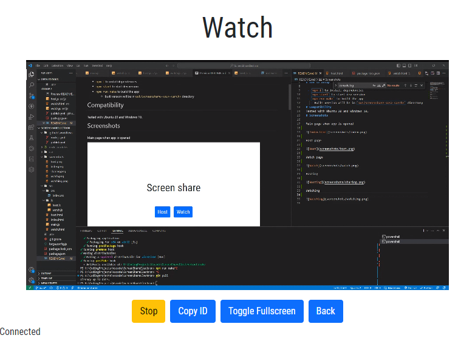

# ScreenShare

For one-way screen sharing. Made with Electron and vanilla JS.

# How to setup

 - `npm i` to install dependencies
 - `npm start` to start dev version
 - `npm run make` to build the app
   - Built version will be in `out/screenshare-<os>-<arch>` directory
# Compatibility
Tested with Ubuntu 20 and Windows 10.
# Screenshots

Main page when app is opened

Host page

Watch page

Hosting

Watching

