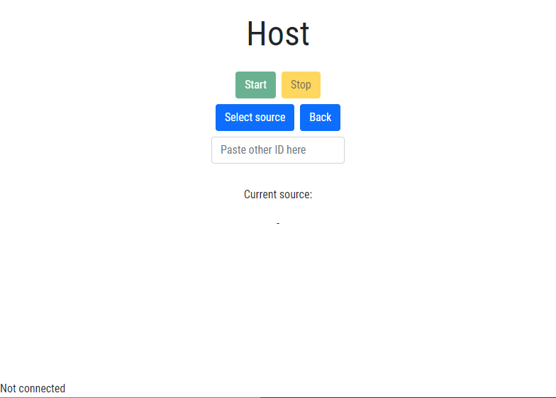
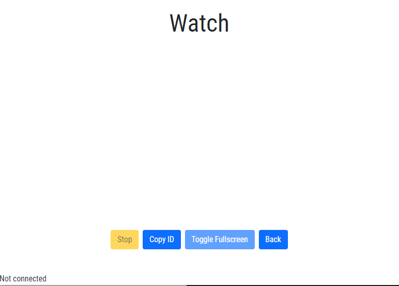

# ScreenShare

For one-way screen sharing. Made with Electron and vanilla JS.

# How to setup

 - `npm i` to install dependencies
 - `npm start` to start dev version
 - `npm run make` to build the app
   - Built version will be in `out/` directory

# Screenshots

